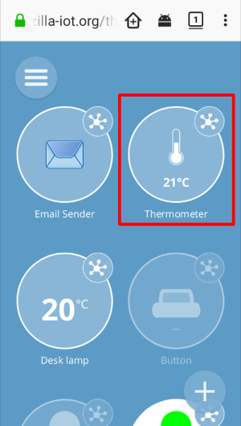
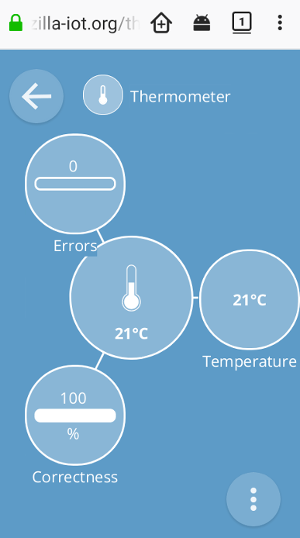
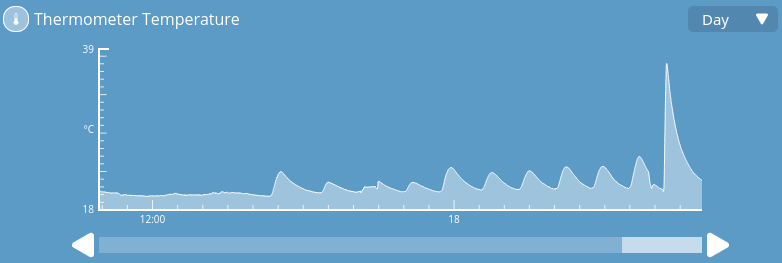
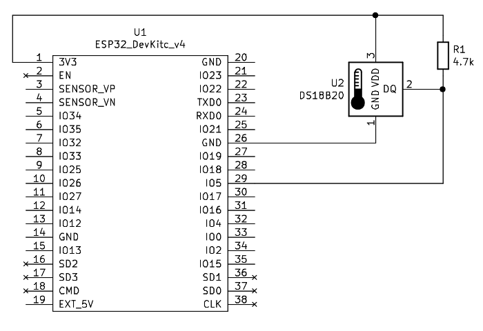

# Web connected thermometer

## Introduction

This example presents how to use *Web Thing Server* on ESP32 (with [esp-idf ver. 4.0](https://github.com/espressif/esp-idf)) to run the thermometer thing.

The thermometer has the following properties:

* temperature
* errors
* correctness

Pictures below show Gateway Web Interface for this thing.

 

The third picture shows the logs presented on Gateway in category `Logs` for the last 24 hours.



In order to fully use the potential of IoT, and to have access to *things* from the Internet, it is best to run *WebThing Gateway* in the same WiFi network.

## How to use example

This project requires following software in components directory (placed in project folder):

* [thing_thermometer](https://github.com/KrzysztofZurek1973/iot_components/tree/master/thing_thermometer)
* [web_thing_server](https://github.com/KrzysztofZurek1973/iot_components/tree/master/web_thing_server)
* [esp32-owb](https://github.com/DavidAntliff/esp32-owb)
* [esp32-ds18b20](https://github.com/DavidAntliff/esp32-ds18b20)

Detailed informations about every component are placed in it's own folder.

### Hardware

The scheme below shows the connection of DS18B20 sensor to ESP32 devkit. A 4.7k resistor is required for the proper operation of the 1-wire interface.



The ESP32 pin to which the sensor is connected can be set in the item menu `Thermometer Configuration`. Default value is GPIO5.

### Power-up

By the first power-up the node starts in **AP** mode with SSID: ```iot-node-ap``` and password: ```htqn9Fzv```. After loggin into this WiFi network load the main page by typing in browser ```iot-node-ap.local:8080/``` (it does not work on Android) or ```192.168.4.1:8080/```.

On the page write SSID and password of the WiFi network where the node will work. In the last position enter the local node's name.

Pressing *submit* causes writing data into flash and restart of the node in *station* mode. If you want to change the WiFi SSID or password later just connect ```GPIO27``` to GND, this causes node's restart in **AP** mode as in the previous paragraph.

If *WebThing Gateway* runs in the same WiFi network go to *Things* category on gateway and press *plus* sign. Gateway shoud find new things, press *Save* and *Done*.

Now you have 2 new things in your IoT network and you can control them from anywhere you are.

### Start-up step by step description

After power-up information about CPU is sent to serial port (e.g. /dev/ttyUSB0 in Linux). Serial port speed is set on 115200 bps.

```init_delete_button``` - initialization of ```GPIO27``` for restarting in **AP** mode.

```init_things``` - things initialization (see things documentation).

```init_nvs``` - checks if WiFi SSID and password are saved in flash, if so WiFi initialization takes place in *station* mode (```wifi_init_sta```) and the node connects to the WiFi network.

If SSID or pasword were not found node starts in *softAP* mode (```wifi_init_softap```).

In the main loop information about free heap memory is sent every 2 seconds on serial port (for debug purposes).

*Web Thing Server* starts running after event ```IP_EVENT_STA_GOT_IP```. Server runs on port 8080  (more information in *Web Thing Server* documentation).

After that the sntp client (```init_sntp```) is started.

### Project Configuration

```
idf.py menuconfig
```

In the *Web Thing Example* menu item, you can set the ```GPIO``` for led (default 26) and for button (default 22).

### Build and Flash


Build: ```idf.py build```

Flash: ```idf.py flash``` and press boot button.

## Links

* [WebThing Gateway](https://iot.mozilla.org/gateway/) - https://iot.mozilla.org/gateway/
* [Web Thing API](https://iot.mozilla.org/wot/) - https://iot.mozilla.org/wot/
* [esp-idf](https://github.com/espressif/esp-idf) - https://github.com/espressif/esp-idf
* [esp32-owb](https://github.com/DavidAntliff/esp32-owb)
* [esp32-ds18b20](https://github.com/DavidAntliff/esp32-ds18b20)

## License

This project is licensed under the MIT License.

## Authors

* **Krzysztof Zurek** - [kz](https://github.com/KrzysztofZurek1973)
